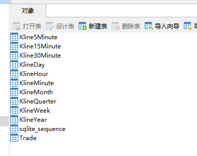
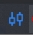
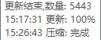

### 说明

1. 从通达信获取数据[`https://github.com/injoyai/tdx`](https://github.com/injoyai/tdx)
2. 存入到sqlite3
3. 进行数据分析,回测等,通过运行代码的方式
4. 一期完成,下载[`windows桌面端数据拉取工具`](https://github.com/injoyai/stock/releases/download/v0.1.0/desktop.exe)

### 科普

#### 新韭菜,有些理解可能不是很准确

1. 中国的股市开盘时间为：每周一至周五的上午9:30——11：30， 下午13:00——15:00。中国股市收盘时间为：每周一至周五的下午3点。

2. 600开头的股票是上证A股，属于大盘股，其中6006开头的股票是最早上市的股票， 6016开头的股票为大盘蓝筹股；900开头的股票是上证B股；
   000开头的股票是深证A股，001、002开头的股票也都属于深证A股， 其中002开头的股票是深证A股中小企业股票；200开头的股票是深证B股；
   300开头的股票是创业板股票；400开头的股票是三板市场股票。

### 数据接口

1. 通达信的协议 [`https://github.com/injoyai/tdx`](https://github.com/injoyai/tdx)

2. 实时行情数据  [`http://vip.stock.finance.sina.com.cn/mkt/#hs_a`](http://vip.stock.finance.sina.com.cn/mkt/#hs_a)
   描述: A 股数据是从新浪财经获取的数据, 重复运行本函数会被新浪暂时封 IP, 建议增加时间间隔 限量: 单次返回所有 A
   股上市公司的实时行情数据

3. 历史行情数据  [`https://finance.sina.com.cn/realstock/company/sh600006/nc.shtml`](https://finance.sina.com.cn/realstock/company/sh600006/nc.shtml)
   描述: A 股数据是从新浪财经获取的数据, 历史数据按日频率更新; 注意其中的 sh689009 为 CDR, 请 通过 stock_zh_a_cdr_daily
   接口获取 限量: 单次返回指定 A 股上市公司指定日期间的历史行情日频率数据

### 详情

* 一期完成,下载: [`windows桌面端数据拉取工具`](https://github.com/injoyai/stock/releases/download/v0.1.0/desktop.exe)
* 个人使用中,代码位置在[`cmd/desktop/`](https://github.com/injoyai/stock/blob/main/cmd/desktop/)
* 每天上午9点自动更新是否是工作日的数据
* 每天下午3点1分自动更新K线数据,需要分时成交数据的,拉取自己改代码,分时成交数据需要大于4T的磁盘
* 更新完数据后会保存一份csv数据和一份zip数据,个人通过百度网盘把zip同步到云端

* 结构
    - 代码(例sz000001)
        - KlineMinute(`1分K线`)
        - Kline5Minute`(5分K线)`
        - Kline15Minute`(15分K线)`
        - Kline30Minute`(30分K线)`
        - KlineHour`(时K线)`
        - KlineDay`(日K线)`
        - KlineWeek`(周K线)`
        - KlineMonth`(月K线)`
        - KlineQuarter`(季度K线)`
        - KlineYear`(年K线)`
        - Trace`(分时成交)`

   

   

   

### 小工具-实时分时

   位置: [`cmd/chart/chart.go`](https://github.com/injoyai/stock/blob/main/cmd/chart/chart.go)
   
