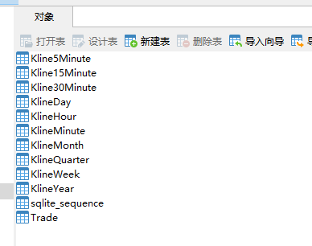

## 说明
* 通达信桌面端服务,在系统托盘内运行
* 拉取所有股票的所有类型K线图
* 不包括分时成交,太大了,可能需要好几T的磁盘,
* 有需要可自行拉取修改,或减少拉取股票的数量
* 能下载,单线程,速度有点慢,迟点增加协程数量

---
* 结构
    - 代码(例sz000001)
        - KlineMinute(`1分K线`)
        - Kline5Minute`(5分K线)`
        - Kline15Minute`(15分K线)`
        - Kline30Minute`(30分K线)`
        - KlineHour`(时K线)`
        - KlineDay`(日K线)`
        - KlineWeek`(周K线)`
        - KlineMonth`(月K线)`
        - KlineQuarter`(季度K线)`
        - KlineYear`(年K线)`
        - Trace`(分时成交)`

   